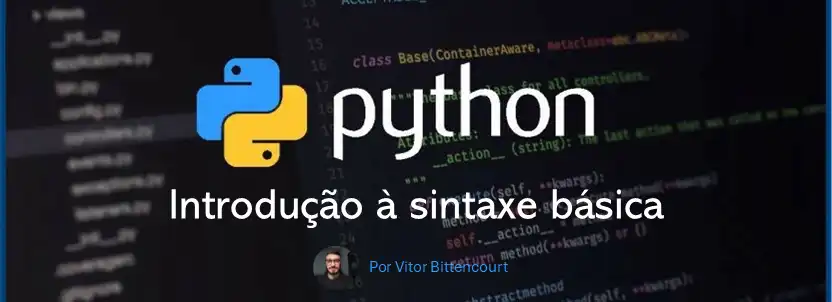
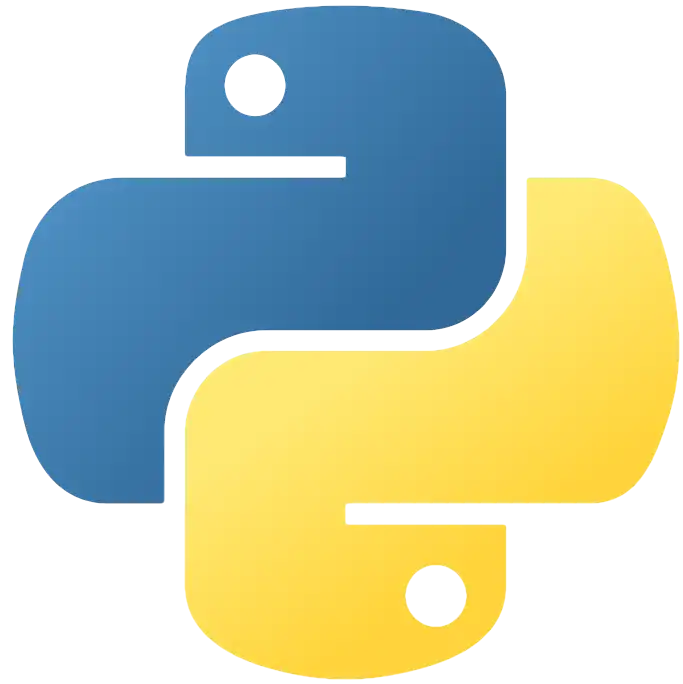

<p align="center">

</p>

# Introdução à Sintaxe Básica em Python

## Introdução
Python é uma linguagem de programação amplamente utilizada por sua simplicidade e facilidade de leitura. Neste artigo, abordaremos a sintaxe básica do Python, incluindo operadores, strings, estruturas condicionais, estruturas de repetição e funções, com exemplos práticos para facilitar o aprendizado.

<p align="center">

</p>

## 1. Operadores
Operadores são símbolos que realizam operações entre variáveis e valores. Em Python, temos diversos tipos de operadores, como lógicos, de identidade, de comparação, de atribuição, de associação e aritméticos.

### 1.1 Operadores Lógicos
Os operadores lógicos são utilizados para combinar expressões condicionais.

```python
# Operador AND (só retorna true se ambas as condições forem True)
print(True and True)   # True
print(True and False)  # False

# Operador OR (retorna True se uma das condições for True)
print(True or False)   # True

# Operador NOT (inverte a condição)
print(not True)        # False
print(not False)       # True
print(not "")          # True (string vazia é considerada False)
print(not "hello")     # False (string com conteúdo é considerada True)
```

### 1.2 Operadores de Identidade
Os operadores de identidade verificam se duas variáveis fazem referência ao mesmo objeto:

```python
curso = "curso de python"
nome_curso = curso
saldo, limite = 200, 300

# Operador is
print(curso is nome_curso)  # True
print(saldo is limite)      # False

# Operador is not
print(curso is not nome_curso)  # False
print(saldo is not limite)      # True
```

### 1.3 Operadores de Comparação
Os operadores de comparação são utilizados para comparar valores.

```python
print(2 == 2)  # igual a -> retorna True
print(2 != 2)  # diferente de -> retorna False
print(2 > 2)   # maior que -> retorna False
print(2 < 2)   # menor que -> retorna False
print(2 >= 2)  # maior ou igual -> retorna True
print(2 <= 2)  # menor ou igual -> retorna True
```

### 1.4 Operadores de Atribuição
Os operadores de atribuição são utilizados para atribuir valores a variáveis.

```python
a = 10
a += 10  # a = a + 10
a -= 10  # a = a - 10
a *= 10  # a = a * 10
a /= 10  # a = a / 10
a %= 10  # a = a % 10
a **= 10 # a = a ** 10
```

### 1.5 Operadores de Associação
Os operadores de associação verificam se um objeto está presente em uma sequência.

```python
lista = [1, 2, 3, 4, 5]
print(3 in lista)  # True
print(6 not in lista)  # True

x = 5
print(x in lista)  # True
print(x not in lista)  # False
```

### 1.6 Operadores Aritméticos
Os operadores aritméticos realizam operações matemáticas.

```python
print(2 + 2)  # Soma = 4
print(4 - 2)  # Subtração = 2
print(2 * 3)  # Multiplicação = 6
print(4 / 2)  # Divisão = 2
print(5 % 2)  # Módulo = 1
print(2 ** 3)  # Potenciação = 8
```

## 2. Strings
Strings são sequências de caracteres. Python oferece diversos métodos para manipulação de strings.

### 2.1 Métodos úteis
```python
curso = "            python    "
print(curso.strip())  # "python" remove os espaços
print(curso.lstrip()) # "python    " remove os espaços à esquerda
print(curso.rstrip()) # "            python" remove os espaços à direita

curso = "pYtHoN"
print(curso.upper())  # "PYTHON" passa tudo para maiúsculo
print(curso.lower())  # "python" passa tudo para minúsculo
print(curso.title())  # "Python" primeira letra maiúscula
```

### 2.2 Interpolação de Variáveis
```python
nome = "Vitor"
idade = 27
print(f"Nome: {nome}, Idade: {idade}") # Nome: Vitor, Idade: 27
```

### 2.3 Fatiamento de Strings
```python
frase = "Python para Análise de Dados"
print(frase[:6])   # Python
print(frase[7:])   # para Análise de Dados
print(frase[::-1])  # Inverte a string
```

## 3. Estruturas Condicionais

### 3.1 If/Elif/Else
```python
nota = 7.5
if nota >= 7:
  print("Aprovado")
elif nota >= 4:
  print("Recuperação")
else:
  print("Reprovado")
```

### 3.2 Operador Ternário
```python
idade = 20
status = "Maior de idade" if idade >= 18 else "Menor de idade"
print(status)
```

## 4. Estruturas de Repetição

### 4.1 Loop For
```python
for i in range(5):
  print(i, end=' ') # 0 1 2 3 4
```

### 4.2 Loop While
```python
contador = 0
while contador < 5:
  print(contador)
  contador += 1
```

## 5. Funções

### 5.1 Definição de Função
```python
def soma(a, b):
  return a + b
print(soma(2, 3))  # 5
```

### 5.2 Argumentos Nomeados
```python
def salvar_carro(marca, modelo, ano, placa):
  print(f"Carro inserido com sucesso! {marca}/{modelo}/{ano}/{placa}")

salvar_carro(marca="Mercedes", modelo="A200", ano=2016, placa="ABC-1234")
```

### 5.3 *args e **kwargs
```python
def somar(*numeros):
  return sum(numeros)
print(somar(1, 2, 3, 4, 5))  # 15
```

## Conclusão
Neste artigo, abordamos a sintaxe básica do Python, cobrindo operadores, strings, estruturas condicionais, estruturas de repetição e funções. Esses conceitos são essenciais para qualquer pessoa que deseja iniciar na programação com Python. Com esses fundamentos, você estará bem equipado para começar a desenvolver programas em Python e explorar tópicos mais avançados da linguagem.