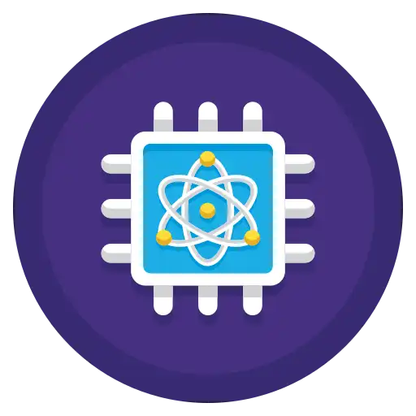
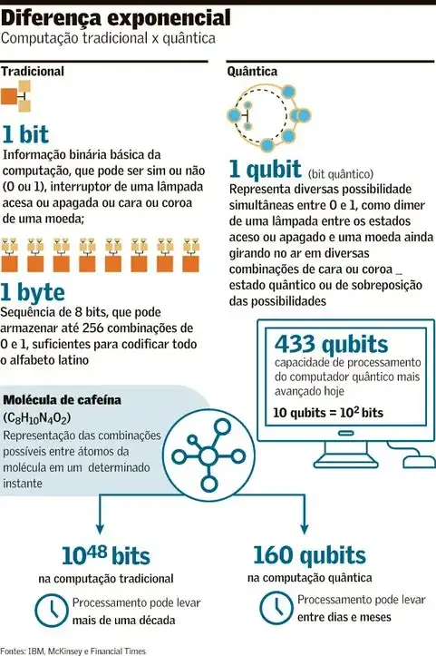
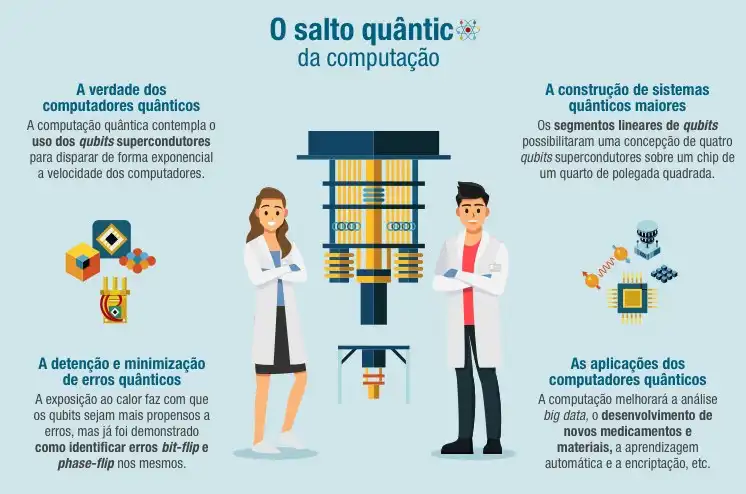

# Computação Quântica: A próxima revolução tecnológica e o Estado Topológico da matéria

## Introdução
A Microsoft anunciou a criação do primeiro chip quântico, o **Majorana 1**, um marco significativo na computação quântica, que explora um novo estado da matéria: nem sólido, nem líquido, nem gasoso, nem condensado de Bose-Einstein, nem plasma. O novo estado da matéria é conhecido como **“Estado Topológico”**. Após 17 anos de pesquisa, a empresa apresentou um avanço que promete revolucionar a forma como processamos informações, resolvemos problemas complexos e entendemos a própria natureza da matéria. Neste artigo, vamos explorar o que é a computação quântica, o conceito de estado topológico, os avanços que essa tecnologia pode proporcionar no cotidiano e em níveis industriais e tecnológicos, e os principais desafios para torná-la viável.

> **"A natureza não é clássica, e se queremos entendê-la, precisamos pensar de forma quântica."** - Richard Feynman

---

## 1. O que é Computação Quântica?
A computação quântica é um campo multidisciplinar que compreende aspectos da ciência da computação, da física e da matemática, e que utiliza a mecânica quântica para resolver problemas complexos mais rapidamente do que em computadores tradicionais. O campo da computação quântica inclui pesquisa de hardware e desenvolvimento de aplicações. Os computadores quânticos são capazes de resolver certos tipos de problemas mais rapidamente do que os computadores tradicionais, aproveitando os efeitos da mecânica quântica, como **superposição** e **interferência quântica**.

Algumas aplicações em que os computadores quânticos podem fornecer esse aumento de velocidade incluem:
- **Machine Learning**
- **Otimização**
- **Simulação de sistemas físicos**

Eventuais casos de uso podem ser a otimização de portfólios em finanças ou a simulação de sistemas químicos, resolvendo problemas que atualmente são impossíveis até mesmo para os supercomputadores mais poderosos do mercado.

Enquanto os computadores tradicionais operam com **bits (0 ou 1)**, os computadores quânticos usam **qubits**, que podem existir em múltiplos estados simultaneamente, permitindo processamento paralelo em larga escala.

**Para entender melhor:** Imagine que o bit seja uma moeda lançada para cima. O resultado desse lançamento só poderia ser “cara” ou “coroa” por vez. O **Qubit** é como se a moeda estivesse girando em uma superfície, com o resultado podendo ser “cara” e “coroa” ao mesmo tempo.

---

### 1.1. Diferenças entre Computação Clássica e Quântica
- **Bits vs. Qubits:** Enquanto bits são binários, qubits podem estar em superposição de estados.
- **Paralelismo Quântico:** Capacidade de processar múltiplas possibilidades ao mesmo tempo.
- **Emaranhamento Quântico:** Fenômeno onde qubits interconectados compartilham estados, independentemente da distância.

---

### 1.2. Quais são os princípios da computação quântica?
Um computador quântico funciona usando princípios quânticos. Esses princípios requerem um novo dicionário de termos para serem totalmente compreendidos. Os termos incluem **superposição**, **entrelaçamento** e **decoerência**. Vamos entender esses princípios a seguir.

#### Superposição
A superposição afirma que, assim como as ondas na física clássica, você pode adicionar dois ou mais estados quânticos, e o resultado será outro estado quântico válido. Por outro lado, você também pode representar cada estado quântico como uma soma de dois ou mais estados distintos. Essa superposição de bits quânticos fornece aos computadores quânticos seu paralelismo inerente, permitindo que processem milhões de operações simultaneamente.

#### Entrelaçamento
O entrelaçamento quântico ocorre quando dois sistemas se ligam tão intimamente que o conhecimento sobre um fornece a você conhecimento imediato sobre o outro, não importa quão distantes eles estejam.

#### Decoerência
A decoerência é a perda do estado quântico em um bit quântico. Fatores ambientais, como a radiação, podem causar o colapso do estado quântico dos bits quânticos. Um dos grandes desafios de engenharia na construção de um computador quântico é projetar vários recursos que tentam retardar a decoerência do estado, como a construção de estruturas especiais que protegem os bits quânticos de campos externos. E é aqui que entra a nova descoberta da Microsoft: o **Estado Topológico**.

---

## 2. O que é o Estado Topológico da Matéria?
O estado topológico é uma fase da matéria que emerge das propriedades topológicas das partículas, como os **férmions de Majorana**, que são quasipartículas propostas para armazenar e manipular informações quânticas de forma robusta. Esses estados são altamente estáveis e resistentes a interferências externas, o que os torna ideais para a computação quântica. Esse estado é o melhor resultado que já tivemos para retardar a decoerência das estruturas especiais que protegem os Qubits.

---

### 2.1. Férmions de Majorana e sua Importância
Os **Férmions de Majorana** foram teorizados há quase cem anos pelo físico italiano **Ettore Majorana**. Ele previu a existência de uma partícula que seria sua própria antipartícula.

Mas o que isso quer dizer? Em outras palavras, se dois Férmions de Majorana se encontrassem, eles poderiam se aniquilar, liberando energia, ou continuar existindo como partículas independentes. Essa dualidade foi explorada matematicamente, mas nunca havia sido observada experimentalmente até três anos atrás.

Em 2022, a equipe da Microsoft conseguiu detectar o férmion de Majorana pela primeira vez, previsto por Ettore. Em 2023, conseguiu controlar essa partícula e usá-la para criar um novo tipo de material, o **topocondutor**.

**E quais as características e importância dessas partículas?**
- **Estabilidade:** Menor suscetibilidade a ruídos e decoerência quântica.
- **Aplicações em Qubits:** Podem ser usados para criar qubits topológicos, que são mais confiáveis do que os qubits convencionais.
- **Descoberta e Implementação:** O chip **Majorana 1** da Microsoft é um exemplo prático da aplicação desses conceitos.

---

## 3. Avanços Tecnológicos Possíveis com a Computação Quântica
A computação quântica promete revolucionar diversas áreas, desde a ciência de materiais até a inteligência artificial. Abaixo, destaco alguns dos avanços mais promissores:

### 3.1. Resolução de Problemas Complexos
- **Otimização:** Soluções mais eficientes para problemas logísticos, como roteamento e gestão de cadeias de suprimentos.
- **Simulações Moleculares:** Descoberta de novos materiais e medicamentos por meio da simulação precisa de moléculas e reações químicas.

### 3.2. Inteligência Artificial e Machine Learning
- **Processamento de Dados:** Aceleração no treinamento de modelos de machine learning.
- **Algoritmos Quânticos:** Desenvolvimento de algoritmos que superam os métodos clássicos em tarefas como reconhecimento de padrões e análise de big data.

### 3.3. Criptografia e Segurança da Informação
- **Criptografia Quântica:** Sistemas de comunicação ultra-seguros baseados em emaranhamento quântico.
- **Quebra de Códigos:** Capacidade de decifrar sistemas criptográficos atuais, como o RSA, exigindo o desenvolvimento de novas técnicas de segurança.

### 3.4. Espaço Aéreo
- **Otimização de Rotas:** Em caso de tempestades, computadores quânticos podem analisar variáveis exponenciais para determinar rotas ideais, minimizando perturbações.
- **Logística de Peças de Reposição:** Identificar as melhores localizações para posicionar peças de reposição, reduzindo impactos em passageiros, tripulação e horários de manutenção.

### 3.5. Química
- **Simulação Molecular:** Modelagem precisa de novas estruturas moleculares, como refrigerantes de baixo impacto ambiental e solventes para captura de CO₂.
- **Descoberta de Materiais:** Aceleração no desenvolvimento de materiais inovadores com propriedades específicas.

### 3.6. Cuidados de Saúde e Produtos Farmacêuticos
- **Aceleração de Pesquisas:** Redução do tempo de desenvolvimento de medicamentos, encurtando a fase pré-clínica de 3-6 anos.
- **Modelagem Molecular:** Melhoria na identificação e validação de alvos terapêuticos, otimizando o processo de descoberta de fármacos.

### 3.7. Finanças
- **Otimização de Carteiras:** Melhoria na gestão de investimentos e precificação de derivados financeiros complexos.
- **Detecção de Fraudes:** Identificação mais rápida e precisa de transações anômalas, aumentando a segurança financeira.

---

## 4. Exemplos Práticos de Aplicação
A computação quântica não se limita a laboratórios e pesquisas acadêmicas; ela tem o potencial de impactar diretamente o cotidiano e a indústria. Abaixo, destacamos exemplos práticos e mundanos que ilustram como essa tecnologia pode transformar nossas vidas.

### 4.1. Aplicações Cotidianas
- **Medicina Personalizada:** Diagnósticos mais precisos e tratamentos personalizados com base em simulações moleculares. Imagine um exame de sangue que, em minutos, identifica a medicação ideal para você, sem efeitos colaterais.
- **Previsão do Tempo:** Modelos climáticos mais acurados, permitindo previsões de longo prazo com maior confiabilidade. Saber com antecedência se vai chover no fim de semana pode ajudar a planejar melhor suas atividades.
- **Eletrônicos Pessoais:** Desenvolvimento de baterias ultraeficientes. Já imaginou ter um celular que dura semanas sem recarregar e que carrega com a luz solar? Ou fones de ouvido que nunca precisam de bateria porque usam energia cinética?

### 4.2. Aplicações Industriais
- **Energia:** Desenvolvimento de baterias mais eficientes e materiais para captação de energia renovável. Painéis solares que geram energia mesmo em dias nublados ou turbinas eólicas que operam com ventos mínimos.
- **Manufatura:** Otimização de processos produtivos e redução de custos operacionais. Fábricas que produzem mais com menos desperdício, reduzindo o preço final dos produtos.

### 4.3. Aplicações Tecnológicas
- **Telecomunicações:** Comunicações ultra-seguras e redes quânticas. Imagine chamadas de vídeo que nunca caem e são impossíveis de serem hackeadas.
- **Computação em Nuvem:** Serviços de computação quântica acessíveis via cloud, como o **Azure Quantum** da Microsoft. Isso pode permitir que pequenas empresas ou até estudantes tenham acesso a supercomputação para projetos inovadores.

### 4.4. Exemplos Mundanos
- **Transporte:** Carros autônomos que usam algoritmos quânticos para tomar decisões em milissegundos, evitando acidentes e otimizando rotas.
- **Compras Online:** Sistemas de recomendação ultra-precisos que sugerem exatamente o que você precisa, baseados em análises quânticas de seus hábitos de consumo.
- **Agricultura:** Sensores quânticos que monitoram o solo e o clima em tempo real, ajudando agricultores a maximizar a produção com menos recursos. Imagine uma horta em casa que se autorregula, usando dados quânticos para saber exatamente quando regar ou adubar.

---

## 5. Desafios e Perspectivas Futuras
Apesar dos avanços, a computação quântica ainda enfrenta desafios significativos, como a decoerência quântica, a escalabilidade de qubits e a necessidade de infraestrutura especializada. No entanto, com o desenvolvimento de tecnologias como o chip **Majorana 1** e o estado topológico, estamos mais próximos de superar essas barreiras.

### 5.1. Desafios Atuais
- **Estabilidade dos Qubits:** Apesar da nova descoberta, manter a coerência quântica por períodos prolongados ainda é um desafio.
- **Escalabilidade:** Aumentar o número de qubits sem comprometer a precisão.
- **Custos e Infraestrutura:** Desenvolvimento de sistemas de refrigeração e controle avançados.
- **Necessidade de novas linguagens de programação:** A criação de algoritmos adaptados para a computação quântica é uma barreira que precisa ser vencida.

### 5.2. Perspectivas Futuras
- **Qubits Topológicos:** Maior confiabilidade e resistência a erros.
- **Integração com Tecnologias Clássicas:** Hibridização entre computação clássica e quântica.
- **Democratização do Acesso:** Expansão de serviços quânticos em nuvem para pesquisadores e empresas.

---

## 6. Reflexão Final
Como **Alan Turing** uma vez disse, *"Podemos apenas ver um pouco do futuro, mas o suficiente para perceber que há muito a ser feito."* A computação quântica, com seu potencial revolucionário, é um vislumbre desse futuro. O desenvolvimento do chip **Majorana 1** e a exploração do estado topológico da matéria são apenas os primeiros passos em uma jornada que promete redefinir os limites da ciência, da tecnologia e da própria humanidade.

Ainda há muitos desafios pela frente, desde a estabilização de qubits até a democratização do acesso a essa tecnologia. No entanto, os avanços já alcançados nos mostram que o caminho vale a pena. A computação quântica não é apenas uma ferramenta para resolver problemas complexos; é uma nova forma de pensar, de explorar e de criar.

À medida que continuamos a desvendar os mistérios da mecânica quântica e a aplicá-los em soluções práticas, estamos construindo as bases para um futuro onde doenças podem ser curadas mais rapidamente, onde a energia será mais limpa e acessível, e onde a inteligência artificial alcançará patamares inimagináveis. O futuro quântico está apenas começando, e ele nos convida a sonhar grande e a agir com determinação.

A revolução quântica não é apenas uma promessa; é um chamado para que todos nós, como sociedade, abracemos a inovação e trabalhemos juntos para moldar um amanhã melhor. O futuro é quântico.

---

### Referências
- **Microsoft’s Majorana 1 chip carves new path for quantum computing.** Disponível em: [Microsoft News](https://news.microsoft.com).
- **Microsoft apresenta chip quântico que pode mudar o mundo da computação.** Disponível em: [CNN Brasil](https://www.cnnbrasil.com.br).
- **Majorana 1: Microsoft cria chip inovador para computação quântica.** Disponível em: [Gizmodo Brasil](https://www.gizmodo.com.br).
- **O que é Computação Quântica?** Disponível em: [AWS](https://aws.amazon.com).
- **Novo material pode controlar quasipartículas para computação quântica.** Disponível em: [Sociedade Brasileira de Física](https://www.sbfisica.org.br).
- **Como a computação quântica irá transformar o futuro de 5 indústrias.** Disponível em: [HoneyWell](https://www.honeywell.com).