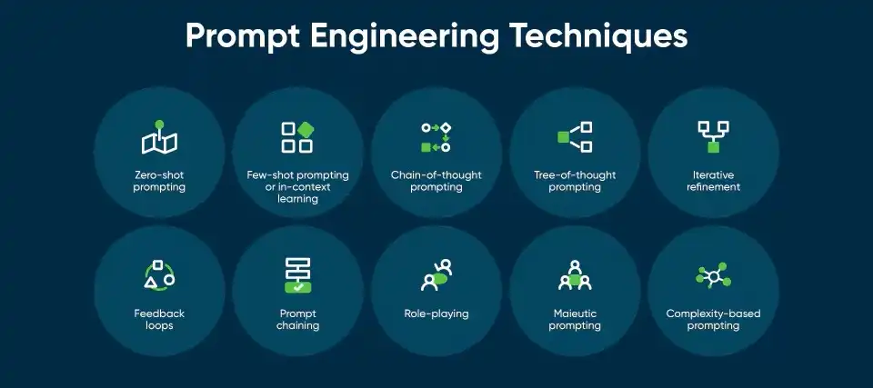

<p align="center">

</p>

# Engenharia de Prompts: Criando Interações Inteligentes com Modelos de IA

## 1. Introdução
A inteligência artificial (IA) tem revolucionado a forma como interagimos com sistemas computacionais, especialmente através de modelos de linguagem de grande escala (LLMs - Large Language Models). Esses modelos são capazes de entender e gerar textos coerentes com base em comandos fornecidos pelo usuário, chamados de "prompts".

A qualidade da resposta gerada pela IA depende diretamente da formulação do prompt. É aqui que entra a Engenharia de Prompts, um campo emergente que busca otimizar a forma como nos comunicamos com esses modelos para obter respostas mais precisas, coerentes e úteis.

Este artigo explora os conceitos fundamentais da Engenharia de Prompts, técnicas avançadas para melhorar a qualidade das interações e práticas recomendadas para maximizar a eficácia dos prompts. Além disso, apresentarei exemplos práticos e um guia para que qualquer pessoa possa aplicar esse conhecimento em suas interações com IA.

<p align="center">

</p>

---

## 2. O que é um Prompt e o que são IAs Generativas e LLMs?

### 2.1 O que é um Prompt?
Um prompt é uma instrução ou conjunto de instruções fornecidas a um modelo de inteligência artificial (IA) para gerar uma resposta. Pode ser uma pergunta, uma frase, um comando ou até mesmo um exemplo que orienta a IA a produzir o resultado desejado. O prompt é a interface entre o usuário e a IA, sendo crucial para obter respostas precisas e relevantes.

**Exemplo de prompt:**
```text
Explique o conceito de gravidade de forma simples para uma criança de 10 anos.
```

O objetivo do prompt é instruir a IA de forma clara e objetiva para que a resposta seja relevante e útil ao usuário.

### 2.2 O que é IA Generativa?
A IA generativa é um ramo da inteligência artificial que se concentra na criação de novos conteúdos, como textos, imagens, vídeos, músicas e até código de programação. Utilizando redes neurais avançadas, como os modelos de Deep Learning (aprendizado profundo), a IA generativa pode produzir saídas que imitam padrões e estilos aprendidos durante seu treinamento.

**Exemplos de aplicações de IA generativa incluem:**
- **Chatbots e assistentes virtuais:** como o ChatGPT, que responde perguntas e gera diálogos naturais.
- **Criação de imagens e vídeos:** ferramentas como DALL·E e MidJourney, que geram imagens a partir de descrições textuais.
- **Composição musical:** algoritmos que compõem melodias originais baseadas em estilos específicos.
- **Geração de código:** modelos como o GitHub Copilot, que sugerem trechos de código para desenvolvedores.

### 2.3 O que é uma IA LLM (Large Language Model)?
Os LLMs (Modelos de Linguagem de Grande Escala) são algoritmos de inteligência artificial treinados com vastas quantidades de dados textuais para entender, interpretar e gerar linguagem natural (linguagem próxima da que falamos no dia a dia). Exemplos populares incluem o ChatGPT, da OpenAI, o DeepSeek, da DeepSeek AI, o Gemini, do Google e o Claude, da Anthropic. Esses modelos utilizam redes neurais avançadas para prever a melhor sequência de palavras com base no contexto do prompt fornecido.

**Os LLMs são capazes de realizar diversas tarefas, como:**
- Responder perguntas;
- Gerar textos criativos;
- Resumir documentos;
- Criar código de programação;
- Traduzir idiomas, entre outros.

---

## 3. O que é Engenharia de Prompts?
A Engenharia de Prompts é a arte e a ciência de projetar e refinar prompts para obter os melhores resultados de modelos de IA generativa. Isso envolve o uso de estratégias específicas para refinar a estrutura do prompt, ajustando seu nível de detalhe, contexto, objetivos e entender como a IA interpreta as entradas e como estruturar essas entradas para maximizar a relevância e utilidade das respostas. É uma disciplina que combina conhecimentos de linguística, psicologia cognitiva e ciência da computação.

A engenharia de prompts é essencial porque pequenas variações na formulação de um prompt podem levar a grandes diferenças na qualidade da resposta. Por exemplo, um prompt mal formulado pode resultar em respostas vagas ou irrelevantes, enquanto um prompt bem elaborado pode gerar insights profundos e úteis.

A capacidade de criar prompts bem elaborados é essencial para extrair o máximo potencial dos LLMs e das IAs generativas, reduzindo respostas imprecisas e tornando a IA uma ferramenta mais eficiente para produtividade e criatividade.

---

## 4. Como Escrever Bons Prompts?
Escrever um bom prompt requer clareza, especificidade, conhecimento das técnicas e, muitas vezes, experimentação para ajustar a formulação ideal.

### 4.1 Técnicas de Engenharia de Prompts
Escrever bons prompts é uma habilidade que pode ser aprimorada com prática e conhecimento das técnicas disponíveis. Abaixo, exploramos algumas das principais técnicas e estratégias para criar prompts eficazes, com exemplos práticos para cada uma.

<p align="center">

</p>

#### Zero-Shot Prompting:
Faz uma pergunta direta sem fornecer exemplos. 

**Exemplo:**
```text
Traduza a frase 'Hello, world!' para o português.
```

**Resposta esperada:**
```text
"Olá, mundo!"
```

Essa técnica é útil quando você espera que o modelo generalize bem para tarefas novas.

#### Few-Shot Prompting: 
Inclui alguns exemplos no prompt para orientar a IA.

**Exemplo:**
```text
Aqui estão alguns exemplos de tradução: 'Hello' -> 'Olá', 'Goodbye' -> 'Adeus'. Agora, traduza 'Good morning'.
```

**Resposta esperada:**
```text
"Bom dia."
```

Essa técnica ajuda a guiar o modelo para o tipo de resposta desejada.

#### In-Context Prompting
Utiliza contexto prévio para influenciar a resposta.

**Exemplo:**
```text
Baseado no texto anterior, resuma os principais pontos abordados.
```

**Resposta esperada:**
```text
Um resumo baseado no texto previamente inserido no contexto
```

Essa técnica fornece o contexto para guiar a resposta da IA.

#### Chain-of-Thought Prompting: 
O modelo é incentivado a "pensar em voz alta", mostrando o raciocínio passo a passo. 

**Exemplo:**
```text
Se João tem 5 maçãs e dá 2 para Maria, quantas maçãs ele tem agora? Explique passo a passo
```

**Resposta esperada:**
```text
Um passo a passo de como a IA "pensou" para resolver o problema.
```

Essa técnica é útil para problemas complexos que requerem raciocínio lógico.

#### Tree-of-Thought Prompting: 
Uma evolução do chain-of-thought, onde o modelo explora múltiplos caminhos de raciocínio antes de chegar a uma conclusão.

**Exemplo:**
```text
Quais são as possíveis causas da inflação? Vamos explorar: 1) Aumento da demanda, 2) Custos de produção elevados, 3) Políticas monetárias expansionistas.
```

**Resposta esperada:**
```text
"As causas da inflação podem incluir aumento da demanda, custos de produção elevados e políticas monetárias expansionistas." (com explicação mais detalhada de cada tópico)
```

Essa técnica é ideal para análises mais profundas.

#### Iterative Refinement:
Refinar o prompt com base nas respostas iniciais da IA.

**Exemplo:**
**Prompt inicial:**
```text
Explique a teoria da relatividade.
```

**Resposta inicial:**
```text
"A teoria da relatividade foi proposta por Einstein e trata da relação entre espaço e tempo."
```

**Prompt refinado:**
```text
Explique a teoria da relatividade de forma mais detalhada, incluindo os conceitos de relatividade especial e geral.
```

**Resposta esperada:**
```text
Uma explicação mais completa e detalhada.
```

#### Feedback Loops:
Usar as respostas da IA para ajustar e melhorar os prompts.

**Exemplo:**
**Prompt inicial:**
```text
Quais são os benefícios do exercício físico?
```

**Resposta inicial:**
```text
Melhora a saúde cardiovascular e reduz o estresse.
```

**Feedback:**
```text
Adicione mais benefícios, como impacto na saúde mental e longevidade.
```

**Resposta esperada:**
```text
Uma lista mais completa de benefícios.
```

#### Prompt Chaining:
Dividir uma tarefa complexa em vários prompts menores.

**Exemplo:**
**Primeiro prompt:**
```text
Resuma o artigo abaixo em 3 parágrafos.
```

**Segundo prompt:**
```text
Agora, faça uma análise crítica do resumo gerado.
```

**Resposta esperada:**
```text
Um resumo seguido de uma análise crítica.
```

#### Role-Playing:
Pedir que a IA assuma um papel específico.

**Exemplo:**
```text
Agora você é um especialista em marketing digital, escreva um roteiro para posts nas redes sociais
```

**Resposta esperada:**
```text
Um plano de marketing para posts nas redes sociais.
```

#### Maieutic Prompting:
Usar perguntas para guiar a IA a descobrir a resposta por si mesma.

**Exemplo:**
```text
Por que a reciclagem é importante para o meio ambiente?
```

**Resposta esperada:**
```text
Uma explicação sobre os benefícios da reciclagem.
```

#### Complexity-Based Prompting:
Ajustar o nível de complexidade do prompt para obter respostas mais simples ou detalhadas. 

**Exemplo:**
```text
Explique a teoria da relatividade para um estudante do ensino médio.
```

**Resposta esperada:**
```text
Uma explicação simplificada e acessível.
```

### 4.2 Como Conseguir Prompts Mais Acertivos?
- **Seja claro e específico:** Evite ambiguidades. Em vez de "Fale sobre energia", use "Explique as vantagens e desvantagens da energia solar."
- **Forneça contexto:** Adicione informações relevantes para guiar a IA. Por exemplo: "Considerando o cenário econômico atual, quais são as tendências para o mercado de ações?"
- **Use exemplos:** Mostre à IA o formato ou estilo de resposta que você espera.
- **Teste e refine:** Experimente diferentes versões do prompt e ajuste com base nas respostas. E lembre-se, refinamento não é erro!

### 4.3 O Que Evitar ao Escrever Prompts?
- **Prompts vagos:** "Fale sobre tecnologia" é muito amplo. Especifique o que você quer: "Quais são as tendências tecnológicas para 2025?"
- **Excesso de complexidade:** Prompts muito longos ou confusos podem dificultar a compreensão da IA. Utilize a técnica de Prompt Chaining
- **Viés inconsciente:** Evite prompts que possam levar a respostas tendenciosas ou inadequadas.
- **Ignorar o feedback:** Se a resposta não for satisfatória, não desista. Ajuste o prompt e tente novamente.

---

## 5. A IA Como Ferramenta de Produtividade, Não Substituição
A IA generativa, como os modelos LLM, não deve ser vista como uma ameaça, mas como uma ferramenta para aumentar a produtividade. Elas podem atuar como ferramentas poderosas, e com o uso adequado, pode ser usada para automatizar tarefas repetitivas, obter insights valiosos, aprimorar a criação de conteúdos, gerar ideias, resumir textos e até mesmo ajudar na tomada de decisões. No entanto, o papel humano continua sendo essencial para supervisionar, interpretar e aplicar os resultados gerados pela IA, lembrem-se sempre, IAs também erram e não conseguem fazer interpretações complexas das informações. A colaboração entre humanos e máquinas é o caminho para maximizar o potencial dessa tecnologia.

---

## 6. Exemplos de Prompts para Testes
Aqui separei alguns Prompts criados por mim para que você, leitor, utilize, refine, melhore e veja como a utilização de IAs generativas da forma correta pode potencializar a produtividade!

### 6.1 Prompt para a criação de uma rotina de treino na academia
Copie o Prompt abaixo, e atribua suas informações às variáveis.

**Exemplo:**
```text
{{Biotipo}} = Ectomorfo
{{Periodização}} = 4 dias
{{Disponibilidade}} = 1 hora
{{Tipos de exercício}} = Maquinário e peso livre
{{Nível}} = avançado
{{Objetivo}} = ganho de massa muscular
{{Lesões}} = ombro e joelho
```

**Prompt:**
```text
Contexto
Você agora é um especialista personal trainer e vai me ajudar a montar um treino ideal, baseado nas variáveis abaixo:

Área de variáveis
{{Biotipo}}
{{Periodização}}
{{Disponibilidade}}
{{Tipos de exercício}}
{{Nível}}
{{Objetivo}}
{{Lesões}}

Regras
Regra 1: Biotipo
Identificar qual o tipo informado nas variáveis acima:

Ectomorfo: Corpo mais magro, difícil ganhar peso e massa muscular.

Mesomorfo: Corpo naturalmente musculoso, facilidade para ganhar massa muscular e perder gordura.

Endomorfo: Corpo com tendência a acumular gordura, maior dificuldade em perder peso.

Regra 2: Periodização
Dependendo da quantidade mínima de dias informados na área de variáveis, criar uma das periodizações de treino abaixo:

1 dia: Treino Full Body

2 dias: Treino com divisão AB

3 dias: Treino com divisão ABC

4 dias: Treino com divisão ABCD

5 dias: Treino com divisão ABCDE

Sendo cada letra da periodização acima, um conjunto de grupamentos musculares a serem treinados, exemplo de divisão ABCDE:
A: Costas
B: Peito
C: Ombro
D: Bíceps e Tríceps
E: Perna

Regra 3: Disponibilidade
Nessa variável, queremos quanto tempo disponível a pessoa tem no dia de treino dela.

Menos que 1 hora: Usar uma quantidade de exercícios que seja possível terminar em menos de 1 hora.

Entre 1 e 2 horas: Usar uma quantidade de exercícios que seja possível terminar entre 1 e 2 horas.

Mais que 2 horas: Usar a quantidade de exercícios que forem necessárias.

Regra 4: Tipos de exercício

Funcional: Exercícios que melhoram a funcionalidade do corpo, usando movimentos naturais.

Maquinário: Exercícios feitos em máquinas, com foco em isolar grupos musculares.

Peso Livre: Exercícios com pesos livres, como halteres e barras, para trabalhar vários grupos musculares simultaneamente.

Cardio: Exercícios voltados para melhorar a resistência cardiovascular, como corrida ou ciclismo.

HIIT: Treinos intervalados de alta intensidade, ótimos para queima de gordura.

Regra 5: Nível
Nível é a variável que define há quanto tempo a pessoa treina e qual intensidade será colocada nos seus treinos.

Iniciante: Se a pessoa for iniciante, significa que ela treina há no máximo 6 meses, então o treino precisa ser mais leve, como um treino de adaptação.

Intermediário: Se a pessoa for intermediária, significa que ela treina entre 6 meses a 2 anos, então o treino precisa ser mais intenso que o iniciante.

Avançado: Se a pessoa for avançada, significa que ela treina há mais de 2 anos, então seu treino pode ser mais intenso.

Regra 6: Objetivo

Perda de Peso ou Gordura: Se o objetivo informado na área de variáveis for perder peso ou gordura, dar prioridade para exercícios de cardio e hiit, juntamente com exercícios em peso livre.

Ganho de massa muscular ou de peso: Se o objetivo informado na área de variáveis for ganho de massa muscular ou de peso, dar prioridade para exercícios em maquinário e peso livre, com menor intensidade de cardio.

Treino Funcional: Se o objetivo informado na área de variáveis for treino funcional, mesclar entre os tipos de exercício funcional e cardio.

Manutenção do Peso ou manter a massa corporal: Se o objetivo informado na área de variáveis for para manter e fazer apenas a manutenção da massa corporal, fazer um treino equilibrado entre os tipos de exercício em maquinário, peso livre e cardio.

Regra 7: Lesões
Caso a pessoa coloque algum valor na varíavel lesões, identificar onde é a lesão e evitar tais exercícios, alguns exemplos:

Lesão ou dor no joelho: evitar exercícios em peso livre para as pernas ou que precise flexionar os joelhos.

Lesão ou dor no ombro: evitar exercícios com barras livres para peito.

Resultado Esperado
Com base nos valores informados na área de variáveis e com as guidelines, crie um treino ideal e personalizado para a pessoa que corresponde a combinação desses 7 valores.
```

### 6.2 Prompt para a criação de documentação de projetos para desenvolvedores
Esse Prompt foi criado para documentar o desenvolvimento de um sistema bancário, com um guia para a formatação da documentação, copie o prompt e use as informações do seu projeto no # Objetivo Geral e # Contexto!

**Prompt:**
```text
Objetivo geral
Criar um sistema bancário com operações: sacar, depositar e visualizar extrato

Contexto
Fomos contratados por um grande banco para desenvolver seu novo sistema. Esse banco deseja modernizar suas operações e por isso escolheu a linguagem Python. Para primeira versão do seu sistema devemos implementar apenas 3 operações: sacar, depositar e visualizar extrato

Operação de depósito: Deve ser possível depositar valores positivos para a minha conta bancária. A v1 do projeto trabalha apenas com 1 usuário, dessa forma não precisamos nos preocupar em identificar qual é o número da agência e conta bancária. Todos os depósitos devem ser armazenados em uma variável e exibidos na operação de extrato.

Operação de saque: O sistema deve permitir realizar 3 saques diários com limite máximo de R$ 500,00 por saque. Caso o usuário não tenha saldo em conta, o sistema deve exibir uma mensagem informando que não será possível sacar o dinheiro por falta de saldo. Todos os saques devem ser armazenados em uma variável e exibidos na operação de extrato.

Operação de extrato: Essa operação deve listar todos os depósitos e saques realizados na conta. No fim da listagem deve ser exibido o saldo atual da conta. Se o extrato estiver em branco, exibir a mensagem: Não foram realizadas movimentações.
Os valores devem ser exibidos utilizando o formato R$ xxx.xx, exemplo:
1500.45 = R$ 1500.45

Tarefa
Utilizando o contexto dos arquivos do projeto, crie um texto em markdown para documentar o projeto e colocar no readme.md, incluindo as funcionalidades, a estrutura de pastas, a regra de negócio e toda documentação importante no contexto do projeto. Crie sessões como: Um resumo do projeto, desafios a serem cumpridos, estrutura e organização das pastas, tecnologias e ferramentas utilizadas, licença, desenvolvedor do projeto etc.

utilize o template de readme a seguir:

<p align="center">  <br /> <b>Spider-Man | Multiversos</b> <br /> <sub><sup><b>(LANDING-PAGE-SPIDERMAN)</b></sup></sub> <br /> </p> <p align="center"> Este projeto é uma landing page dedicada ao universo do Homem-Aranha, apresentando diferentes versões do herói interpretadas por Tobey Maguire, Andrew Garfield e Tom Holland. A página é construída com HTML, CSS e JavaScript, proporcionando uma experiência visual rica e interativa. <br /> </p>
Estrutura do Projeto
Páginas Principais
index.html: Página inicial com um carrossel de cards destacando as diferentes versões do Homem-Aranha.

spiderman1.html: Página dedicada ao primeiro filme de cada ator.

spiderman2.html: Página dedicada ao segundo filme de cada ator.

spiderman3.html: Página dedicada ao terceiro filme de cada ator.

Estrutura de Pastas
landing-page-spiderman
├── assets
│ ├── css
│ │ └── home-page-styles.css
│ ├── images
│ │ ├── icons
│ │ │ └── spider.svg
│ │ ├── pic-sm-bg-01.jpg
│ │ ├── pic-sm-bg-02.jpg
│ │ ├── pic-sm-bg-03.jpg
│ │ └── spiderman-01.png
│ └── scripts
│ └── script.js
├── index.html
└── pages
├── andrew-garfield
│ ├── spiderman1.html
│ ├── spiderman2.html
├── tobey-maguire
│ ├── spiderman1.html
│ ├── spiderman2.html
│ └── spiderman3.html
└── tom-holland
├── spiderman1.html
├── spiderman2.html
└── spiderman3.html

Funcionalidades
Carrossel de Cards: Apresenta os três atores que interpretaram o Homem-Aranha, com links para suas respectivas páginas.

Vídeos de Trailer: Cada página de filme inclui um vídeo de trailer que é reproduzido automaticamente.

Galeria de Imagens: Galeria de imagens para cada filme, com suporte a Fancybox para visualização em tela cheia.

Tecnologias Utilizadas
HTML5: Estrutura das páginas.

CSS3: Estilização das páginas.

JavaScript: Funcionalidades interativas, como o carrossel de cards.

Fancybox: Biblioteca para visualização de imagens em tela cheia.

Licença
Este software é licenciado sob os termos da MIT License.

⌨️ Desenvolvido por Vitor Bittencourt
```

### 6.3 Prompt para a geração de currículos
Esse Prompt foi criado para gerar currículos personalizados para cada vaga, basta alterar algumas informações para que a IA dê o foco que a vaga mais precisa! A IA vai pedir para que você forneça o seu currículo previamente feito e vai formatar da melhor forma para a vaga. No caso, ele está formatado para uma vaga de desenvolvedor Python

**Prompt:**
```text
Você é um consultor de carreira especialista em currículos de tecnologia. Formate meu currículo para a vaga de desenvolvedor Python / TI na {{Nome da empresa}}, deixando claro, profissional e bem estruturado para os filtros e ats de plataformas de recrutamento como gupy, linkedin etc.

Primeiro, peça que o candidato envie o currículo em pdf ou copie o texto e cole no chat. Depois, prossiga com a formatação.

Informações Gerais:
• Sem emojis ou imagens, apenas caracteres para organização.
• Layout profissional, objetivo e fácil de ler.
• Use palavras-chave ligadas a desenvolvimento Python, metodologias ágeis, construção de software, análise e desenvolvimento de novas soluções e análise bancária.

Estrutura do Currículo:

CABEÇALHO:
• Nome em destaque.
• Contato (telefone, e-mail, LinkedIn, cidade/estado, GitHub).

PERFIL PROFISSIONAL:
• Resumo destacando experiência ou intenção de ingressar no setor de tecnologia e desenvolvimento Python.
• Se estiver migrando de área, destacar habilidades transferíveis.
• Caso não tenha experiência, reforçar formações e cursos.

FORMAÇÃO ACADÊMICA:
• Curso(s), instituição(ões) e previsão de conclusão (se aplicável).

CERTIFICAÇÕES:
• Outros cursos relevantes (Linguagens de programação, tecnologias, desenvolvimento etc).

EXPERIÊNCIA PROFISSIONAL:

Para cada experiência:
• Empresa | Cargo | Período (MM/AAAA - MM/AAAA ou ‘Atual’).
• Descrição com foco em:
• Ideiais inovadoras de resolução de problemas.
• Desenvolvimento de projetos.
• Análise bancária.
• Se não tiver experiência, incluir projetos acadêmicos ou extracurriculares.

HABILIDADES:
• Tecnologias de desenvolvimento.
• Ferramentas de automação de processos.
• Análise de dados.
• Organização, trabalho em equipe e foco em resultados.

Formate todas as informações de forma clara e otimizada para o setor desenvolvedor Python/TI, com no máximo duas páginas.

Utilize também as informações da vaga abaixo:

. Propor soluções para problemas
. Atuar nas demandas de desenvolvimento e otimização
. Identificar e mapear corretamente os processos manuais que podem ser automatizados
. Garantir que a automação seja eficiente e sem impacto negativo no fluxo de trabalho
```

---

## 7. Conclusão
A Engenharia de Prompts é uma habilidade essencial para interagir de forma eficaz com modelos de IA, permitindo extrair respostas mais precisas e relevantes. Dominar essa prática pode melhorar significativamente a produtividade, a criatividade e a tomada de decisões. À medida que a tecnologia evolui, a capacidade de formular prompts bem estruturados se torna uma competência valiosa para profissionais de diversas áreas. Lembre-se de que a IA é uma ferramenta poderosa, mas seu sucesso depende da qualidade das instruções que você fornece. Praticando as técnicas apresentadas e com atenção aos detalhes, você pode maximizar o potencial da IA e utilizá-la de maneira mais estratégica e eficiente, transformando a interação em uma experiência produtiva e enriquecedora.

Experimente os prompts sugeridos, refine suas técnicas e explore as infinitas possibilidades que a Engenharia de Prompts oferece. O futuro da colaboração entre humanos e máquinas está em suas mãos!