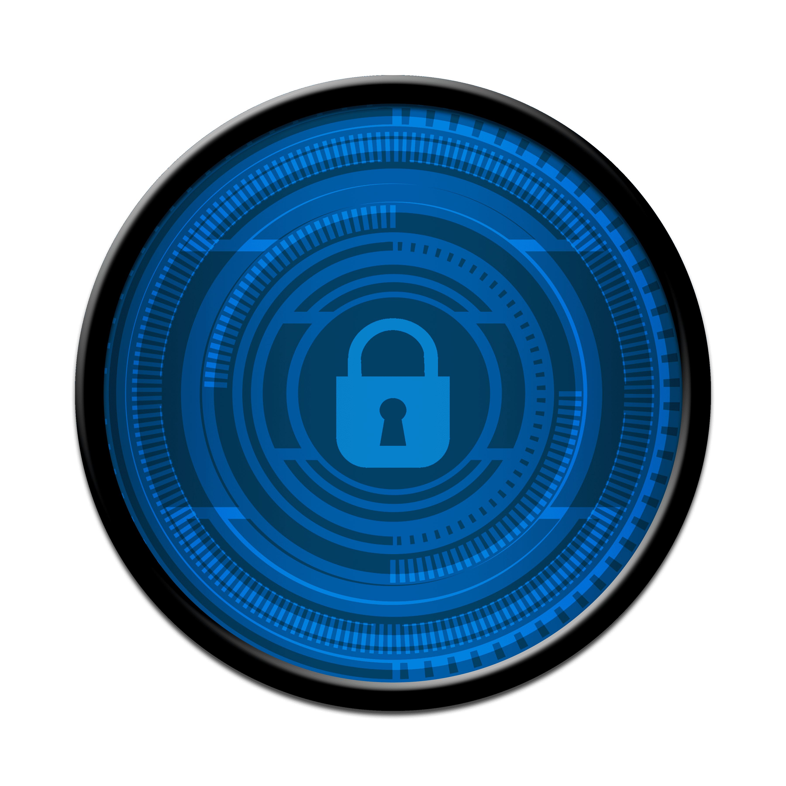
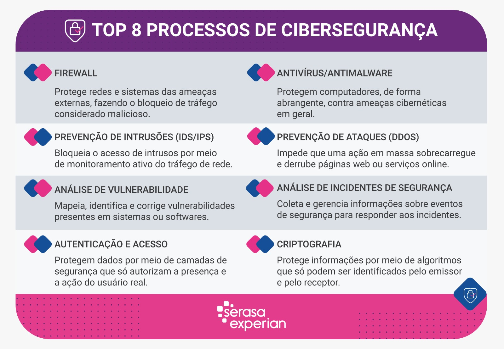
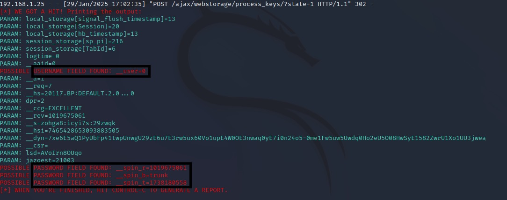
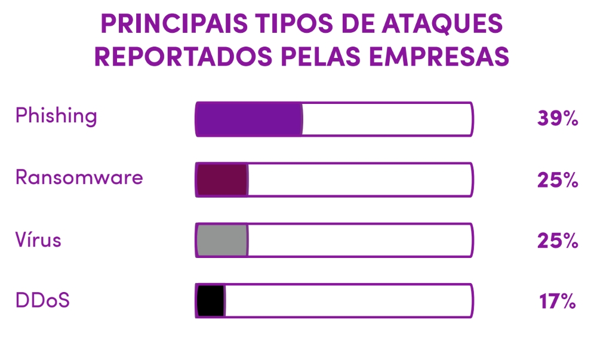
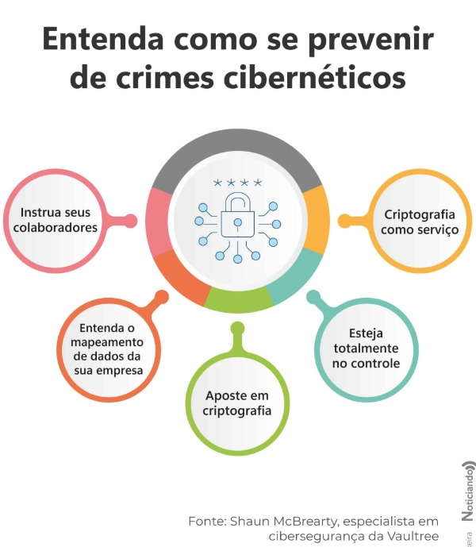
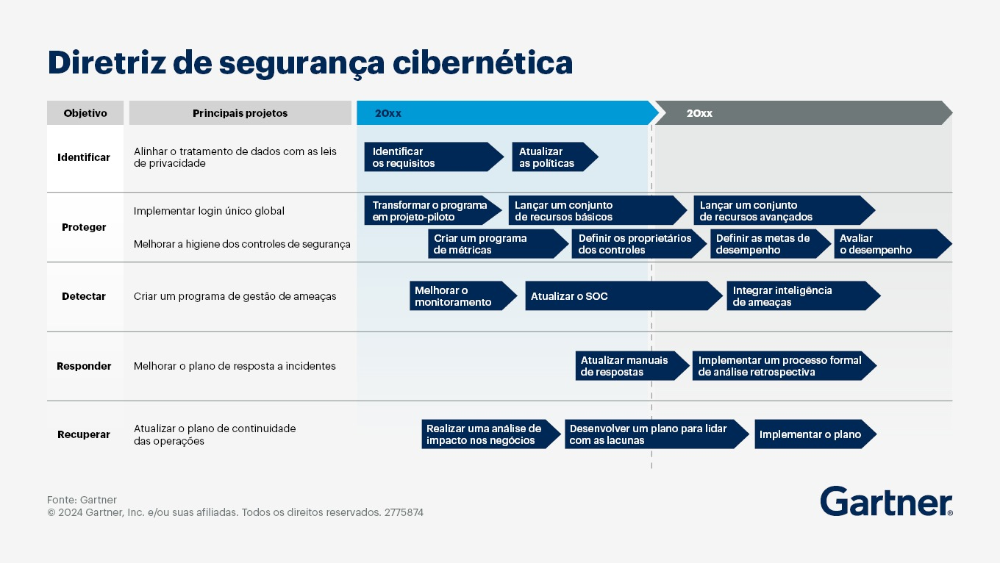

# Segurança Cibernética: Entenda os Ataques e Aprenda a se Defender

## 1. Introdução

A segurança cibernética tornou-se um dos temas mais críticos da era digital. Com o aumento do uso da internet para atividades financeiras, empresariais e pessoais, os ataques cibernéticos cresceram exponencialmente.

Segundo a FortiGuard Labs, laboratório de análise e inteligência de ameaças da Fortinet, companhia de cibersegurança, em 2024, o Brasil foi alvo de 356 bilhões de tentativas de ataques cibernéticos, que consiste em, mais ou menos, 677.389 ataques por minuto no país.

Segundo O Globo, dados do Gabinete de Segurança Nacional indicam um aumento de ações do tipo em todo país. No primeiro semestre de 2024, os casos já haviam superado o total de 2023. Ao final do ano, o crescimento de ataques em 2024 foi de 70% em relação a 2023, e não há nenhum indicativo de que esse número vai diminuir.

Ainda segundo a Check Point Research, o Brasil é o segundo país mais atacado no mundo, ficando atrás somente dos Estados Unidos. Os ataques cibernéticos direcionados à América Latina vem crescendo desenfreadamente nos últimos anos.

Além dos números de ataques continuarem crescendo, segundo o IBSEC - Instituto Brasileiro de CiberSegurança, o Brasil enfrenta um déficit de 750 mil profissionais de CiberSegurança, com essa lacuna sendo ainda maior no resto do mundo.

Sabendo de todos esses dados estatísticos, precisamos começar a fazer o nosso papel para com a nossa própria segurança digital. Com o desenvolvimento tecnológico constante, possível criação de novos computadores quânticos, aperfeiçoamento das técnicas hackers e empresas com seu time de segurança cibernética sobrecarregado, a tendência é a quantidade de ataques ser cada vez maior.

Este artigo tem como objetivo fornecer uma visão abrangente sobre os principais tipos de ataques cibernéticos, suas metodologias, e as melhores práticas para se proteger. Além disso, discutiremos os desafios enfrentados para criar um ecossistema digital mais seguro.

---

## 2. O que é a Segurança Cibernética?

A segurança cibernética refere-se ao conjunto de práticas, tecnologias e processos projetados para proteger sistemas, redes e dados contra ataques digitais, danos e acessos não autorizados. Esses ataques podem variar desde tentativas de roubo de informações sensíveis até a interrupção de serviços essenciais. A segurança cibernética abrange uma ampla gama de áreas, envolve proteção de informações sensíveis, prevenção contra invasões e implementação de protocolos seguros. Além disso, inclui estratégias para detectar, responder e mitigar ameaças cibernéticas de forma eficaz.

---

## 3. Qual a Importância da Segurança Cibernética?

A importância da segurança cibernética não pode ser subestimada. Com a crescente digitalização das atividades cotidianas, e em um mundo onde os dados são o novo petróleo, a segurança cibernética é essencial para proteger informações pessoais, empresariais e governamentais. Um ataque bem-sucedido pode resultar em perdas financeiras, roubo de identidade e até mesmo falhas operacionais em infraestruturas críticas, como redes elétricas, sistemas hospitalares e setores financeiros. Além disso, com o advento da Internet das Coisas (IoT) e da computação em nuvem, a superfície de ataque aumentou consideravelmente, tornando a segurança cibernética uma prioridade absoluta. A implementação de boas práticas e soluções tecnológicas adequadas minimiza os riscos associados aos ataques cibernéticos.

---

## 4. Princípios Fundamentais da Cibersegurança

Para garantir um ambiente digital seguro, profissionais e empresas seguem diretrizes fundamentais da cibersegurança, que incluem:

### 4.1 Princípios da Segurança da Informação (CIA Triad)

Os três pilares básicos da segurança da informação são:

- **Confidencialidade:** Garante que os dados sejam acessados apenas por pessoas autorizadas.
- **Integridade:** Assegura que as informações não sejam alteradas indevidamente.
- **Disponibilidade:** Mantém os sistemas e dados acessíveis sempre que necessário.

### 4.2 Segurança em Camadas (Defesa em Profundidade)

A defesa cibernética deve ser implementada em várias camadas, dificultando que um invasor consiga comprometer um sistema por completo. Isso inclui firewalls, antivírus, criptografia, monitoramento de rede e autenticação multifator (MFA).

### 4.3 Princípio do Menor Privilégio (PoLP - Principle of Least Privilege)

Os usuários devem ter apenas os acessos mínimos necessários para realizar seu trabalho. Isso reduz os danos em caso de comprometimento de credenciais.

### 4.4 Política de Segurança da Informação (PSI)

Empresas devem estabelecer diretrizes sobre o uso seguro de sistemas, dispositivos e dados, determinando boas práticas e sanções para violações.

### 4.5 Gestão de Riscos

Avaliação contínua dos riscos cibernéticos para antecipar ameaças e implementar controles adequados.

### 4.6 Monitoramento Contínuo

Uso de ferramentas como SIEM (Security Information and Event Management) para analisar logs e identificar atividades suspeitas em tempo real.

### 4.7 Backup e Recuperação de Desastres

Manter backups regulares, armazenados de forma segura, para garantir a recuperação rápida em caso de ataque ransomware ou falha de hardware.

---

## 5. O que são Máquinas Virtuais e Como são Utilizadas para Cometer Crimes?

Uma máquina virtual (VM) é um ambiente virtualizado que simula um computador físico. Ela permite a execução de múltiplos sistemas operacionais em um único hardware físico (um único computador contendo vários SO). Embora as VMs sejam amplamente utilizadas para testes, desenvolvimento e isolamento de ambientes, elas também podem ser usadas para fins maliciosos. Criminosos cibernéticos podem usar VMs para criar ambientes isolados onde realizam atividades ilegais, como o desenvolvimento de malware ou a execução de ataques, sem deixar rastros no sistema hospedeiro e dificultando a rastreabilidade das atividades ilícitas.

**Exemplo Prático:**

Um atacante pode usar uma VM para testar diferentes tipos de malware em um ambiente controlado antes de lançar um ataque em larga escala. Isso permite que ele refine suas técnicas e evite detecção por sistemas de segurança.

---

## 6. Engenharia Social e Phishing

A engenharia social explora a manipulação psicológica para enganar usuários e obter informações confidenciais. O phishing é uma forma comum de engenharia social, onde os atacantes enviam e-mails ou mensagens que parecem legítimas, mas que na verdade são projetadas para roubar informações como senhas, números de cartão de crédito ou dados bancários. Tipo de Phishing: 

- **Spear Phishing:** Ataques direcionados a indivíduos ou organizações específicas.
- **Whaling:** Focado em alvos de alto escalão, como CEOs e diretores.
- **Smishing:** Phishing via SMS.
- **Vishing:** Ataques realizados por chamadas telefônicas.

**Exemplo Prático:**

Durante meus estudos, práticas e projetos envolvendo segurança cibernética, desenvolvi um Phishing para roubar senhas do Facebook, imitando perfeitamente a página de login e utilizando uma VM com sistema operacional Linux no meu computador Windows. Assim a minha “vítima” poderia achar que está fazendo login no facebook, e após digitar seu usuário, senha e apertar enter, suas credenciais foram diretamente para o terminal da minha VM, como mostrado na imagem abaixo. Enquanto para a vítima, a página apenas recarregou para, dessa vez, a página real de login do facebook.

Esse tipo de ataque não só é um dos mais comuns, como também não exige praticamente nenhum conhecimento em programação para executá-lo, mostrando, então, como a engenharia social também pode ser uma arma muito perigosa para esses ataques.

---

## 7. Conceitos e Técnicas da Varredura de Redes

A varredura de redes é uma técnica usada para identificar dispositivos ativos, portas abertas e serviços em execução em uma rede. Ferramentas como Nmap são comumente usadas para essa finalidade. Embora a varredura de redes seja uma prática legítima para administradores de sistemas, ela também pode ser usada por atacantes para mapear vulnerabilidades em uma rede antes de lançar um ataque.

**Exemplo Prático:**

Um atacante pode usar o Nmap para identificar todos os dispositivos conectados a uma rede corporativa e descobrir quais portas estão abertas. Isso pode revelar serviços vulneráveis que podem ser explorados.

---

## 8. Pós-Exploração em Sistemas Comprometidos

Após a invasão, atacantes realizam a pós-exploração para manter acesso, escalar privilégios e extrair dados sem serem detectados. Isso pode incluir a instalação de backdoors, a coleta de credenciais e a movimentação lateral dentro da rede.

**Exemplo Prático:**

Um atacante que consegue acesso a um servidor pode instalar um backdoor para garantir que possa retornar ao sistema mesmo que a vulnerabilidade inicial seja corrigida. Ele também pode usar ferramentas como Mimikatz para coletar senhas de outros usuários na rede.

---

## 9. Ataques Man-in-the-Middle (MITM)

Um ataque Man-in-the-Middle ocorre quando um atacante intercepta a comunicação entre duas partes sem o conhecimento delas. Isso pode ser feito para espionar a comunicação, alterar os dados transmitidos ou injetar malware.

**Exemplo Prático:**

Um atacante pode se posicionar entre um usuário e um site de banco online, capturando as credenciais de login enquanto o usuário acredita que está se comunicando diretamente com o banco.

---

## 10. Ransomwares

O ransomware é um tipo de malware que criptografa arquivos do usuário e exige um resgate em troca da chave de descriptografia. Exemplos notáveis incluem:

- **WannaCry (2017):** Infectou mais de 200.000 computadores em 150 países.
- **NotPetya (2017):** Disfarçado de ransomware, era na verdade um ataque destrutivo contra empresas.
- **REvil:** Um dos grupos de ransomware mais conhecidos, visando grandes corporações.

Os ataques são normalmente realizados através de phishing ou exploração de vulnerabilidades em sistemas desatualizados.

---

## 11. Como se Defender desses Ataques?

Agora que você sabe um pouco sobre alguns tipos de ataques, quais são as armas dos atacantes e como eles geralmente se comportam, pode ficar mais facil prever quando você está sendo alvo, e se prevenir melhor para que o ataque não seja bem sucedido. Apesar disso, temos algumas práticas comuns do dia-a-dia que abrem grandes brechas para possíveis hackers e que a grande maioria das pessoas não tem conhecimento, como:

- **Conectar seu celular ou computador à redes públicas, como shoppings e mercados.** Será possível detectar seu aparelho com qualquer tipo de varredura de rede usando o mesmo endereço IP da internet que todos estão conectados, isso pode te deixar vulnerável a ataques se o atacante detectar alguma fragilidade no seu aparelho.
- **Andar com o Bluetooth sempre ligado.** Existem softwares hackers que conseguem acessar seus dados através do bluetooth do seu celular.
- **Usar senhas fracas ou repetidas.** Muitas pessoas utilizam senhas fáceis de adivinhar, como "123456", "senha123" ou o próprio nome. Além disso, repetir a mesma senha em vários serviços aumenta o risco, pois se um site for comprometido, todas as suas contas ficam vulneráveis.
- **Baixar aplicativos e arquivos de fontes não confiáveis:** Instalar apps fora das lojas oficiais (Google Play e App Store) pode expor seu dispositivo a malwares, trojans e spywares que roubam informações sem você perceber.
- **Clicar em links suspeitos recebidos por e-mail, SMS ou WhatsApp:** Campanhas de phishing são extremamente comuns e podem enganar usuários a fornecerem suas credenciais bancárias ou de redes sociais para criminosos.
- **Salvar senhas no navegador sem proteção adequada:** Muitos navegadores oferecem a opção de salvar senhas automaticamente, mas se um malware ou um atacante acessar seu dispositivo, ele poderá visualizar todas as senhas salvas.
- **Deixar a webcam e microfone sempre ativos:** Malwares especializados podem acessar sua câmera e microfone sem que você perceba. Manter a câmera coberta quando não estiver em uso e desativar o microfone pode evitar espionagem.
- **Utilizar dispositivos USB desconhecidos:** Pen drives podem conter malwares que infectam seu computador assim que conectados. Evite usar dispositivos de origem duvidosa ou conectá-los sem antes escanear com um antivírus.

Além de rever algumas dessas práticas, existem também métodos gerais de prevenção:

- **Educação e Conscientização:** Treinar funcionários e usuários para reconhecer e evitar ataques de engenharia social e phishing.
- **Atualizações e Patches:** Manter sistemas e software atualizados para corrigir vulnerabilidades conhecidas.
- **Firewalls e IDS/IPS:** Usar firewalls e sistemas de detecção/prevenção de intrusões para monitorar e bloquear atividades suspeitas.
- **Criptografia:** Usar criptografia para proteger dados em trânsito e em repouso.
- **Backups Regulares:** Realizar backups regulares e testar a recuperação de dados para se proteger contra ransomware.
 
Ao adotar medidas preventivas e ficar atento a essas práticas, você reduz significativamente os riscos de ser vítima de um ataque cibernético.

---

## 12. Como os Profissionais de CiberSegurança Trabalham?

A área de cibersegurança é ampla e envolve diferentes especializações, e hoje sofre com uma carência de profissionais qualificados. Os profissionais dessa área atuam tanto na defesa quanto na identificação de vulnerabilidades, garantindo a proteção de sistemas, redes e dados sensíveis. Dentro da cibersegurança, existem algumas áreas de atuação bem definidas:

- **Red Team:** Profissionais especializados em ataque e testes de intrusão (pentests). Eles simulam ataques cibernéticos para encontrar vulnerabilidades em sistemas, redes e aplicações antes que criminosos reais possam explorá-las. O objetivo é identificar falhas de segurança e relatar suas descobertas para que possam ser corrigidas.
- **Blue Team:** Especialistas em defesa cibernética. Eles monitoram sistemas, analisam ameaças e implementam soluções de segurança para proteger a infraestrutura contra ataques. Esse time usa firewalls, sistemas de detecção de intrusão (IDS/IPS) e diversas técnicas para mitigar riscos.
- **Purple Team:** Um time híbrido que une Red e Blue Teams. O Purple Team trabalha para melhorar a comunicação entre os dois grupos, garantindo que as descobertas dos ataques simulados do Red Team sejam rapidamente incorporadas na defesa pelo Blue Team. Essa colaboração resulta em uma segurança mais robusta.
- **Threat Intelligence (Inteligência de Ameaças):** Equipe responsável por coletar, analisar e interpretar informações sobre ameaças cibernéticas em potencial. Eles monitoram hackers, grupos criminosos e tendências para antecipar ataques antes que aconteçam.
- **Forense Digital:** Especialistas que investigam incidentes de segurança, coletam evidências digitais e analisam ataques após sua ocorrência. O trabalho deles é essencial para identificar invasores e prevenir novos ataques.
- **GRC (Governança, Risco e Conformidade):** Profissionais que garantem que as empresas sigam regulamentações e boas práticas de segurança. Eles definem políticas, realizam auditorias e asseguram a conformidade com leis como a LGPD (Lei Geral de Proteção de Dados) e GDPR (Regulamento Geral de Proteção de Dados da União Europeia).
 
### 12.1 Diretriz da Segurança Cibernética

Identificar, Proteger, Detectar, Responder e Recuperar são as cinco funções principais do NIST Cybersecurity Framework (CSF). Este framework é um conjunto de diretrizes que ajuda as organizações a gerir os riscos de segurança cibernética:

- **Identificar:** Compreender como gerir os riscos de segurança cibernética para sistemas, ativos, dados ou outras fontes.
- **Proteger:** Definir proteções para garantir que os serviços de infraestrutura crítica sejam fornecidos.
- **Detectar:** Desenvolver e implementar atividades para identificar a ocorrência de um evento de segurança cibernética.
- **Responder:** Desenvolver e implementar atividades para agir contra um incidente de segurança cibernética detectado.
- **Recuperar:** Identificar quais serviços devem ser resilientes, bem como descrever as capacidades de restauração de serviços prejudicados.

O CSF é adaptável e pode ser utilizado por organizações de qualquer porte e em qualquer setor. As medidas de segurança cibernética defendem contra ataques cibernéticos e fornecem os benefícios a seguir: Evitar ou reduzir o custo de violações, Manter a conformidade normativa, Mitigar ameaças cibernéticas em desenvolvimento.

### 12.2 Outras Áreas Importantes da Cibersegurança

Além dos profissionais especializados e das diretrizes de segurança, a cibersegurança envolve diversos setores essenciais:

- **Segurança de Aplicações:** Foca na proteção de software e desenvolvimento seguro, prevenindo vulnerabilidades como SQL Injection, XSS e exploração de APIs.
- **Segurança em Nuvem:** Proteção de ambientes na nuvem, garantindo a segurança de dados armazenados em plataformas como AWS, Azure e Google Cloud.
- **Segurança de Redes:** Implementação de firewalls, VPNs e segmentação de rede para evitar invasões.
- **Resiliência Cibernética:** Capacidade de uma organização de se recuperar rapidamente de ataques cibernéticos e minimizar impactos.

---

## 13. Desafios para um Ecossistema Mais Seguro na Internet

- **Complexidade Crescente:** À medida que a tecnologia avança, a complexidade dos sistemas também aumenta, criando mais pontos de vulnerabilidade.
- **Falta de Profissionais Qualificados:** Há uma escassez de profissionais qualificados em segurança cibernética, o que dificulta a proteção adequada dos sistemas.
- **Evolução dos Ataques:** Os atacantes estão constantemente desenvolvendo novas técnicas e ferramentas, tornando a defesa um desafio contínuo.
- **Regulamentação e Compliance:** A conformidade com regulamentações de segurança cibernética pode ser complexa e custosa, especialmente para pequenas e médias empresas.

---

## 14. Conclusão

A segurança cibernética é um campo dinâmico e em constante evolução. Compreender os tipos de ataques e as melhores práticas de defesa é essencial para proteger informações sensíveis e manter a integridade dos sistemas. Embora os desafios sejam significativos, a adoção de uma abordagem proativa e a contínua educação e conscientização podem ajudar a criar um ecossistema digital mais seguro para todos.

Como vimos, hackers podem explorar vulnerabilidades de diversas formas, desde a engenharia social até a invasão direta de redes e sistemas. A melhor defesa contra essas ameaças é a prevenção, o conhecimento e a aplicação de boas práticas de segurança.

É essencial que empresas invistam na proteção de seus sistemas e que os usuários adotem hábitos mais seguros para evitar cair em golpes e ataques. Além disso, a necessidade de profissionais capacitados na área continua crescendo, o que torna a cibersegurança uma excelente opção de carreira para aqueles que se interessam por tecnologia e proteção digital.

Manter-se atualizado sobre as tendências, novas ameaças e ferramentas de defesa é fundamental para garantir um ambiente digital mais seguro para todos. Afinal, na guerra cibernética, o conhecimento é a melhor arma.

---

## Referências

- [Vanzolini - Cibersegurança e Software Seguro](https://www.vanzolini.org.br/)
- [Data For All - Princípios Fundamentais de Cibersegurança](https://dataforall.com/)
- [Microsoft Azure - O que é uma Máquina Virtual?](https://azure.microsoft.com/pt-br/overview/what-is-a-virtual-machine/)
- [EUAX - Pentest](https://www.euax.com.br/)
- [Veritas - Cybersecurity e Análise de Dados](https://www.veritas.com/)
- [CrashPlan - Beyond Predictions: The Critical Role of Data Resilience in 2024](https://www.crashplan.com/)
- [O Globo – Vulnerabilidade virtual: número de ataques cibernéticos contra o governo aumenta; TCU vê risco de vazamento](https://oglobo.globo.com/)
- [CrowdStrike](https://www.crowdstrike.com/)
- [SoftWall - NIST: descubra as 5 funções deste framework de cibersegurança](https://www.softwall.com.br/)
- [IBSEC](https://www.ibsec.com.br/)